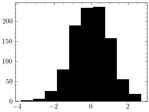

Serialization
=============

A tensor can be saved in binary format (extension .ten) or in matrix market format.

Example:

.. code-block:: cpp

   // Normal distribution
   ten::normal norm;
   // Sample from a normal distribution
   ten::vector<float> x = norm.sample(1000);
   // Save to a mtx file (Matrix Market format)
   ten::save_mtx(x, "norm.mtx");

The saved file can be loaded in numpy:

.. code-block:: python

   import numpy as np
   import scipy as sp
   import matplotlib.pyplot as plt
   a = sp.io.mmread("norm.mtx").flatten()
   plt.hist(a, color = "black")
   plt.show()

